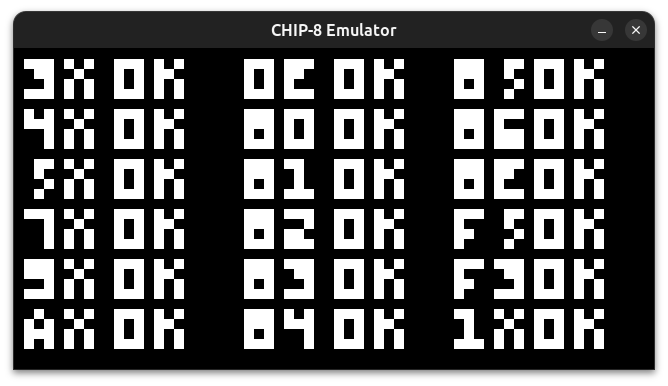

# CHIP 8
An implementation of CHIP8 in C++

## Screenshots




## Building with CMake
```
$ sudo apt-get install cmake libsdl2-dev
$ git clone https://github.com/abatef/CHIP8-Emulator.git
$ cd CHIP8-Emulator
$ cmake CMakeLists.txt
$ make
```

## Usage

```
CHIP8 ./path/to/rom/file
```
## Keymap
| Chip 8 Key | Keyboard Key |
| :--------: | :----------: |
| `1`        | `NUMPAD 1`          |
| `2`        | `NUMPAD 2`          |
| `3`        | `NUMPAD 3`          |
| `4`        | `NUMPAD 4`          |
| `5`        | `NUMPAD 5`          |
| `6`        | `NUMPAD 6`          |
| `7`        | `NUMPAD 7`          |
| `8`        | `NUMPAD 8`          |
| `9`        | `NUMPAD 9`          |
| `0`        | `NUMPAD 0`          |
| `A`        | `A`          |
| `B`        | `B`          |
| `C`        | `C`          |
| `D`        | `D`          |
| `E`        | `E`          |
| `F`        | `F`          |

## Documentation
- [CHIP-8 Technical Reference][technicalRef]
- [CHIP-8 Instruction Set][instructionset]
- [CHIP-8 Instruction Set][cdevernay]
- [Test ROMs][test-roms]
- [More Test ROMs][more-test-roms]

## License

This project is licensed under the GPLv3+.
The file LICENSE includes the full license text.

[technicalRef]: https://github.com/mattmikolay/chip-8/wiki/CHIP%E2%80%908-Technical-Reference
[instructionset]: https://github.com/mattmikolay/chip-8/wiki/CHIP%E2%80%908-Instruction-Set
[cdevernay]: http://devernay.free.fr/hacks/chip8/C8TECH10.HTM
[test-roms]: https://github.com/corax89/chip8-test-rom
[more-test-roms]: https://github.com/mattmikolay/chip-8
